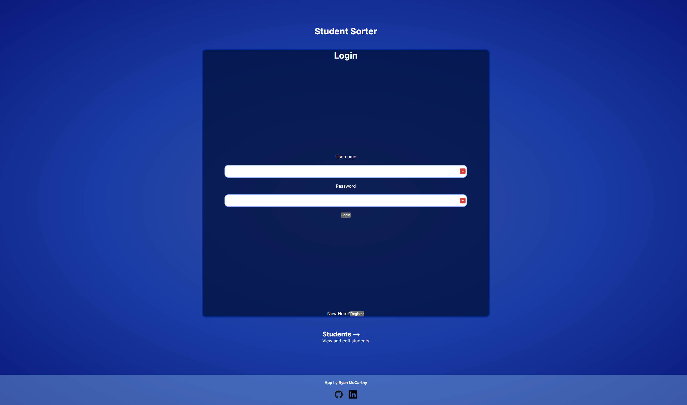
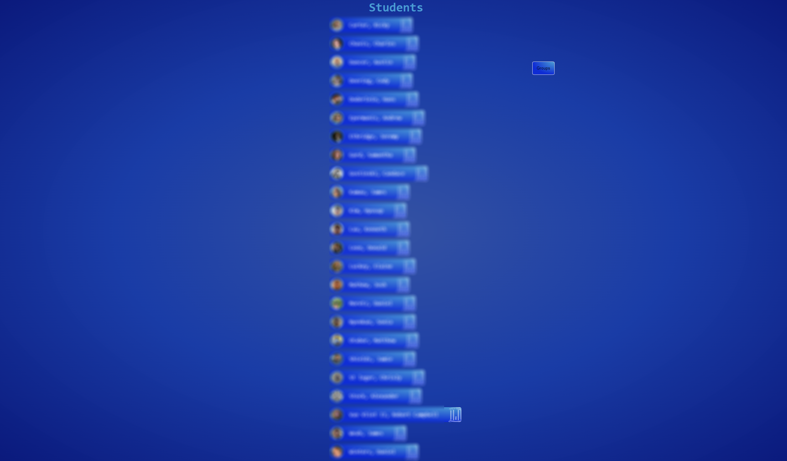

# Student Sorter App

## Table of Contents
- [Introduction](#introduction)
- [Features](#features)
- [Usage](#usage)
- [License](#license)

## Introduction

The Student Sorter App is a powerful tool designed to help educators efficiently organize and manage student data. Whether you're a teacher, administrator, or anyone else involved in education, this app streamlines the process of sorting and categorizing students into individual groups. I made this for my own productivity but feel free to take a look and use/alter it for your own purposes.

## Features

- **User-friendly Interface:** The app offers an intuitive and user-friendly interface, making it easy for educators to navigate and utilize its features. I used a drag and drop library to make the experience easy and fun!
- **Group Creation and Management** Create edit and manage groups through the student page.
- **User Authentication:** Secure user accounts with authentication to ensure data privacy and integrity.
- **Responsive Design:** Access the app from any device with a responsive design that adapts to different screen sizes.

(Student names and pictures have been blurred to preserve privacy)

## Usage

Clone the repo locally or visit the live deployment [here](https://student-sorter.vercel.app/)!

## License
This project is licensed under the MIT License - see the [LICENSE](LICENSE) file for details.
